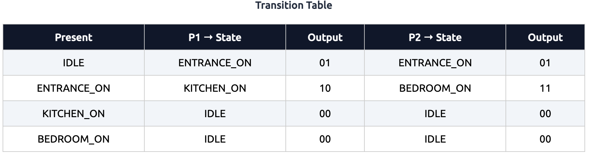
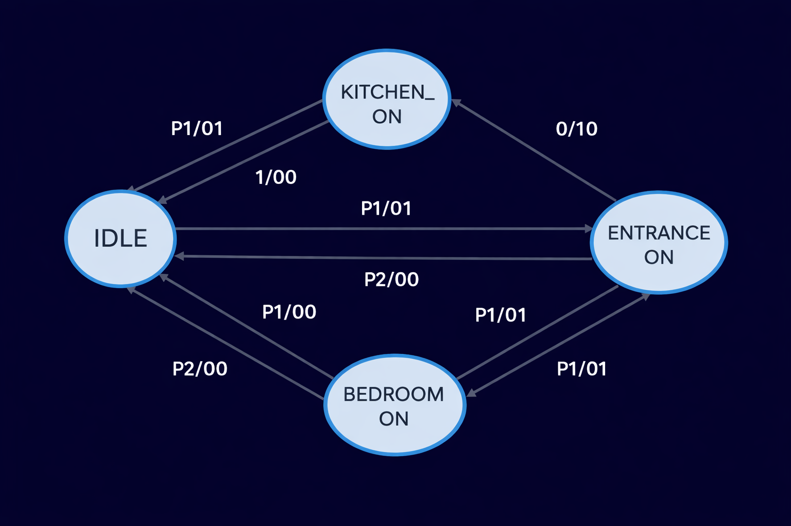

## 🌐 Live Demo

🔗 https://fsm-visualizer-ten.vercel.app/

---

# FSM Visualizer

A web-based Finite State Machine (FSM) visualizer built using **HTML, CSS, and JavaScript**.

---

## 🚀 Overview

This project simulates a real-world lighting system using a **Finite State Machine (FSM)**.  
It demonstrates how inputs trigger transitions between states and produce corresponding outputs.

---

## 🎯 Features

- Interactive FSM simulation  
- Real-time state updates  
- Visual representation using lights  
- Reset functionality  
- Transition Table (theoretical representation)  
- FSM State Diagram  

---

## 🧠 FSM Model

This project is based on a **Mealy Machine**, where:

- Output depends on **current state + input**
- States represent lighting conditions  
- Inputs represent button presses (P1, P2)

---

## 🔄 States

- **IDLE** → All lights OFF  
- **ENTRANCE_ON** → Entrance light ON  
- **KITCHEN_ON** → Kitchen light ON  
- **BEDROOM_ON** → Bedroom light ON  

---

## 🎮 Inputs

- **P1**
- **P2**
- **RESET**

---

## 📊 Transition Table

---

## 🔁 State Transition Diagram

---

## ⚙️ Tech Stack

- HTML5  
- CSS3  
- JavaScript  

---

## 📂 Project Structure

fsm-visualizer/
│── index.html
│── styles.css
│── app.js
│── images/
│── transition-table.png
│── fsm-diagram.png

---

## 🚀 How to Run

1. Clone the repository  

git clone https://github.com/samarth-swami/fsm-visualizer.git

---

## 🎯 Future Improvements

- FSM → Circuit conversion  
- Support for Moore Machines  
- Graph-based FSM editor  
- Export FSM as JSON  

---

## 👨‍💻 Author

**Samarth Swami**  
GSoC 2026 Aspirant | CircuitVerse Contributor  

---

## ⭐ Motivation

This project is built as part of my preparation for **Google Summer of Code 2026**, focusing on contributing to **CircuitVerse** and understanding FSM-based circuit synthesis.
